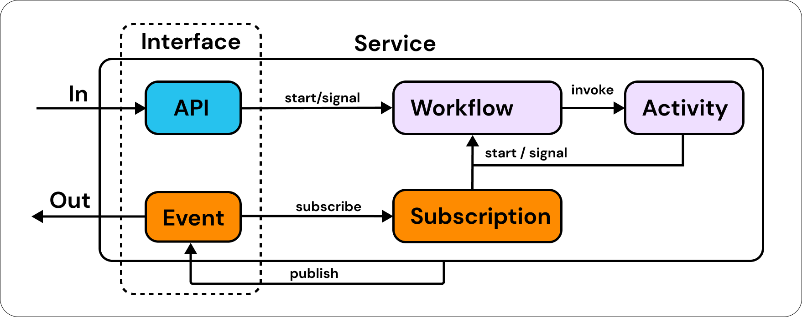

# Welcome to Eventual

For years, I’ve dreamed of building serverless, massively distributed micro-services with the simplicity of a local program. I strongly believe there’s no conceptual difference between a laptop and the cloud. Both are complex systems made of many components. However, while we can simply program our laptop with a single language and runtime, unfortunately, the same is not true for the cloud. The developer experience is still at the “hardware level” so to speak - meaning that developers must understand how to configure each individual service and then glue them together into a functioning architecture. This is hard.

While there’s no conceptual difference between a laptop and the cloud, there is a glaringly obvious physical one - the cloud is massively distributed, and distributed systems are subject to an entire category of new problems around timing, failure and consistency. In a way, a large part of AWS’s business is providing solutions to these problems in the form of managed services, such as AWS Step Functions, or Event Bridge.

But, these services come at the cost of a consistent developer experience. They’re severely disjointed. You can’t just write code and run it - instead you have to: 1) hand-configure these services, all with their own domain specific configuration languages, and 2) reason through each of their failure cases and how they affect each other. You also can’t test all this easily because the entire system can’t run locally. This is why the current “best practice” is that you should mostly rely on integration tests. All of this requires specialized knowledge, has a slow developer iteration cycle, and limits composability and re-usability. Over time this accumulates as tech debt.

We believe that developing a scalable and fault tolerant service should be as lean as building a frontend app in a framework like NextJS. Simply make a change and then observe its impact in less than a second, not minutes or hours. The framework should take care of reasoning through complex failure cases so you can just focus on your application.

This is the vision of Eventual.

Eventual is an open source TypeScript framework that offers "core abstractions" — including APIs, Messaging and long-running, durable Workflows — that shield you from the complexities of distributed systems and ensure a consistent, best-practice serverless architecture. The top-level concept of Eventual is a "Service" that has its own API Gateway, Event Bus, and Workflow Engine that you customize and build on using the core abstractions.

Each Service can be thought of as exposing a Service Interface, consisting of `APIs` and `Events`, and then then performing Event-Driven Orchestration & Choreography with `Workflows`, `Activities` and `Subscriptions`.

These can then be adopted iteratively, and seamlessly integrate and interact with any external or existing system, whether it be a database or another service. In our opinion, having confidence in (and relying on) these consistent patterns can 10x productivity from a reliability, productivity, maintainability and agility standpoint.

Everything can be written and tested in a single TypeScript code-base. You can run your massively scalable distributed cloud system LOCALLY before you even deploy 🤯. Run, test and iterate locally, then deploy only when it’s working. And here's the kicker - you can even debug production locally. That's right - debug your production system on your local machine.

import devCycle from "../assets/dev-cycle.png";

  

Eventual is built with (and consumed from) modern Infrastructure-as-Code tooling such as the AWS CDK and Pulumi to give you maximum flexibility and control, as well as total ownership of your data by deploying everything into your own AWS account and within your own security boundaries. We implement best practices and solve edge cases for you so you can spend more time on your application. Best practice security, best practice scalability, best practice operations, best practice cost efficiency etc. - we lay the groundwork for you.

Finally, because it’s all TypeScript, you have full end-to-end type safety for a massively scalable distributed cloud system. We believe that relying on the TypeScript compiler to scream at you when you make mistakes is one of the biggest time savers you can have as a developer. As you make changes, simply follow the red squiggly lines all the way from your **frontend** → **backend service** → **infrastructure configuration**.

In the next part, [Announcing Eventual Part 2 - Features](./2023-03-17-Announcing-Eventual-Part2-Features.md), we'll walk through each of the features offered by Eventual. Be sure to check that out if you want to see some code!

To jump right in, see the [Quick Start](/quick-start).

-Sam
