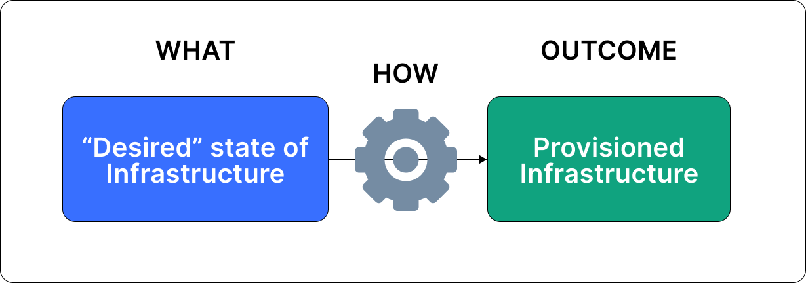
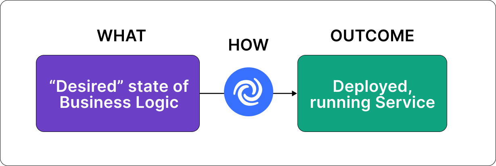
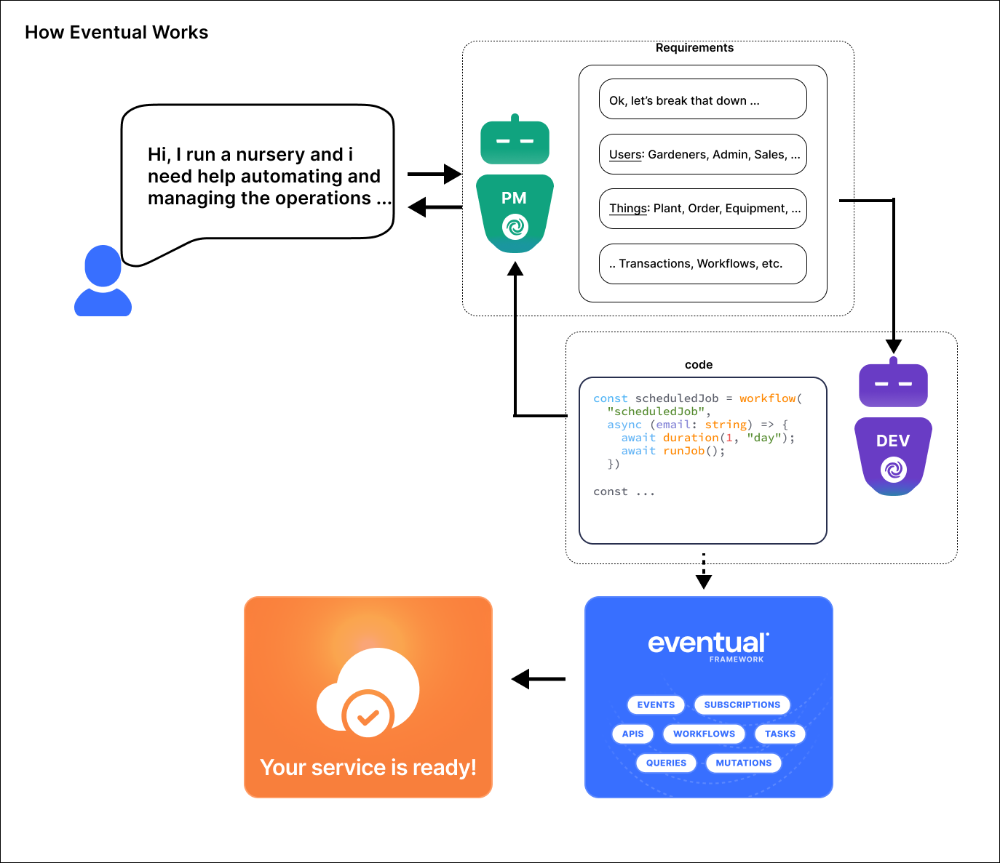

What a year it has been already! It’s only been 3 months and we’ve already seen glimpses of a future that looks nothing like today. A world where real AI (actually intelligent AI) is available to everyone at low-cost. I think we’re all starting to wonder about our place in the world and how we need to change the way we work and what we do.

I’ve always been obsessed with efficiency and abstraction, which is what has drawn me to programming as a profession. For the past 5-6 years I’ve been thinking deeply about how cloud development, specifically on AWS, can be simplified down to a very simple programming model instead of what we have today. I’ve always wondered - what is that next level of abstraction for developers that will unlock more value? The next “infrastructure as code” (IaC), so to speak. I used to believe strongly that it was new programming languages, but it now seems more likely that the next level of abstraction is natural language!

What is powerful about IaC is the concept of “declarative infrastructure”. Instead of worrying about HOW to update your infrastructure configuration, you simply “declare” WHAT infrastructure you need and the engine takes care of “making it happen”. I love this way of working because it eliminates a whole class of problems and enables new forms of abstractions like templates and component libraries of infrastructure.

Today, I’m excited to announce eventualAi (waitlist) and eventualCloud (public beta), which we believe are the next steps in declarative software development - where business requirements can be declared in natural, conversational language and then fed into an AI system that takes care of making it happen.

eventualAi is a companion autonomous software
development team of smart agents who know how to use the eventualCloud framework
and apply Domain Driven Design (DDD) principles to translate business requirements
into functioning services. Feed it your business problem or domain in natural language
and have it “print” on-demand, scalable and fully serverless solutions.

 
 
<iframe
  src="https://www.youtube.com/embed/C3sgTy3W1gw"
  title="YouTube video player"
  frameborder="0"
  allow="accelerometer; autoplay; clipboard-write; encrypted-media; gyroscope; picture-in-picture; web-share"
  allowfullscreen
></iframe>

 
 

eventualCloud is an open source, high-level
framework for building distributed systems on AWS with TypeScript, serverless and
IaC. It provides "core abstractions" — including APIs, Transactions, Messaging and
long-running, durable Workflows — that shield you from the complexities of distributed
systems and ensure a consistent, best-practice serverless architecture. Our goal
with eventualCloud is to streamline and standardize the process of building functional
services on AWS by providing code-first primitives and patterns that align with business
concepts. We won't go deep into the details, for that you can read <a href="https://docs.eventual.ai/blog/eventualCloud-part-1">
  this dedicated blog post
</a>
.

 
 

In short, we’ve long wanted a better way to build cloud services - one that gives the right level of abstractions for distributed systems in a simple programming model. For example, implementing long-running workflows shouldn’t involve learning weird, archaic domain specific languages when we already have tools like if-else, for-loops, async/await in all the programming languages we know and love. We want to program the cloud in the same way we program servers and local machines - and eventualCloud enables this.

An unforeseen benefit of how we built eventualCloud is that the same solutions that make it easier for human engineers to translate business requirements into solutions, also help AI agents do the same. Because our abstractions map closely with business processes and constrain the problem of “build me a service that does XYZ” down to a few repeatable and scalable patterns, intelligent agents built with LLMs (when given the right instructions and context) can apply these patterns just as effectively.

This new capability ushers in a transformative way for businesses to tackle problem-solving. It is now possible to truly “work backwards” from the customer in a declarative way, focusing on WHAT needs to be solved instead of HOW to solve it. Define your business goals, tenets, and policies in natural language, and then employ an intelligent agent to explore your business domain automatically. This intelligent agent can incorporate feedback, suggest improvements, break down the domain into smaller pieces, and even implement solutions. Additionally, it can maintain and operate production services, providing an all-encompassing solution for businesses.

We believe that we’re entering a new era of software development frameworks where the primary user is an intelligent AI with human supervision. Frameworks already do the job of simplifying and standardizing how problems should be solved, making them ideal “targets” for what we think of as “AI compilers” - i.e. systems of intelligent agents that “compile” business problems described in natural language to functioning solutions.

We’ll be sharing more soon. You can start building and playing with the eventualCloud framework today or sign up for the eventualAi waitlist. Come say hi on [Discord](https://discord.gg/8hfnTn3QDT), star us on [GitHub](https://github.com/functionless/eventual), and follow us on [Twitter](https://twitter.com/EventualCloud). We’d love to hear about your business use-cases to help refine the technology before open sourcing it.
