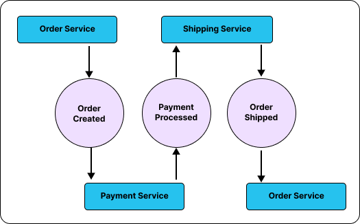

## Choreography vs Orchestration

Welcome to the first blog in a series where we explore Event-Driven Architectures (EDA) and Domain Driven Design (DDD) patterns using eventualCloud - a cloud framework designed for building massively scalable distributed systems.

In this series, we'll showcase how Eventual's distributed systems primitives, APIs, Messaging, Durable Workflows (and more), simplify and standardize the implementation of event-driven architectures on AWS with TypeScript.

Each of the code examples in this series will be available in the [eventual-eda-patterns](https://github.com/functionless/eventual-eda-patterns) repository.

:::info
It is inspired by the amazing [Serverless Land Event-Driven-Architecture (EDA) Visuals](https://serverlessland.com/event-driven-architecture/visuals) created by [David Boyne](https://twitter.com/boyney123).
:::

:::tip
If you're new to EDAs, we highly recommend checking out his resource and this [post](https://theburningmonk.com/2020/08/choreography-vs-orchestration-in-the-land-of-serverless/) from [Yan Cui](https://twitter.com/theburningmonk) (The Burning Monk) for further learning.
:::

# Video

<iframe width="560" height="315" src="https://www.youtube.com/embed/h1UJpuN4vgc" title="YouTube video player" frameborder="0" allow="accelerometer; autoplay; clipboard-write; encrypted-media; gyroscope; picture-in-picture; web-share" allowfullscreen></iframe>

## What are Choreography and Orchestration

In broad strokes there are two main approaches to organizing communication and collaboration between services in event-driven systems: 1) Choreography and 2) Orchestration.


_(source: [Choreography vs Orchestration](https://serverlessland.com/event-driven-architecture/visuals/choreography-vs-orchestration) - [David Boyne](https://twitter.com/boyney123))_

**Choreography** is a decentralized approach where each service is responsible for reacting to events from other services and taking appropriate actions. There is no central coordinator, and the services are loosely coupled.

**Orchestration** is a centralized approach where a coordinator service (orchestrator) is responsible for directing and managing the communication between services, making decisions, and ensuring the correct order of execution.

Eventual provides first-class primitives in TypeScript to support both of these techniques. They can be used interchangeably and are interoperable.

1. The event and subscription primitives streamline the creation and configuration of Event Bridge Rules and Lambda Functions, and maintain type safety across publishers and subscribers.
2. The workflow and task primitives enable the development of long-running, durable workflows using imperative code.

In this blog, we’ll build an example service using Choreography and Orchestration to illustrate their differences and to demonstrate the benefits of eventual.

## Example: Order Processing Pipeline

Our example will process an Order in a hypothetical e-commerce service that performs the following steps:

1. process the Payment
2. ship the Order to the customer
3. update the Order status record

### Using Choreography

To build this process with choreography, events are published and handled for each step in the process.

1. When a customer places an order, the Order Service emits an OrderCreated event.
2. The Payment Service listens for the OrderCreated event, processes the payment, and emits a PaymentProcessed event.
3. The Shipping Service listens for the PaymentProcessed event, and then ships the order.
4. The Order Service listens for the OrderShipped event and updates its status

The below diagram depicts this visually - showing three services “ping ponging” messages between each other.



To build this with `eventual`, we will use the event and `subscription` primitives.

The `event` primitive declares an event with a name and schema. Events can then be published and subscribed to.

```ts
export const OrderCreated = event(
  "OrderCreated",
  z.object({
    orderId: z.string(),
  })
);

export const PaymentProcessed = event(
  "PaymentProcessed",
  z.object({
    orderId: z.string(),
    paymentId: z.string(),
  })
);

export const OrderShipped = event(
  "OrderShipped",
  z.object({
    orderId: z.string(),
    shipmentId: z.string(),
  })
);
```

:::tip
Eventual heavily promotes type safety and schemas. This helps prevent errors early in the development cycle and improves documentation of the system.
:::

The `subscription` primitive can then be used to “subscribe” to one or more events by specifying:

- a unique name to identify the subscription
- a list of events it listens for
- and a handler function that processes them

First, we’ll subscribe to the `OrderCreated` event to charge the card associated with the order and then publish a `PaymentProcessed` event.

```ts
export const processOrderPayment = subscription(
  "processOrderPayment",
  {
    events: [OrderCreated],
  },
  async (event) => {
    // process the payment using an API (e.g. stripe)
    const paymentId = await chargeCard(event.orderId);

    // emit an event that the payment was processed
    await PaymentProcessed.emit({
      orderId: event.orderId,
      paymentId,
    });
  }
);
```

Next, whenever a `PaymentProcessed` event is received, submit the order for shipping, receive a shipmentId and forward that along as an `OrderShipped` event.

```ts
export const shipOrderAfterPayment = subscription(
  "shipOrderAfterPayment",
  {
    events: [PaymentProcessed],
  },
  async (event) => {
    // call the shipOrder API
    const trackingId = await shipOrder(event.orderId);

    // publish an event recording that the order has been shipped
    await OrderShipped.emit({
      orderId: event.orderId,
      trackingId,
    });
  }
);
```

Finally, whenever an `OrderShipped` event is received, update the order status to reflect that change.

```ts
export const updateOrderStatus = subscription(
  "updateOrderStatus",
  {
    events: [OrderShipped],
  },
  async (event) => {
    await updateOrder(event.orderId, { status: "Shipped" });
  }
);
```

All of these steps are performed independently of each other in response to events published to a durable AWS Event Bus. This guarantees that the events will be handled independently of intermittent failures and enables elastic scaling.

Eventual creates a best-practice serverless architecture for each Subscription - consisting of a dedicated Lambda Function for processing each event, an Event Bridge Rule to route events to your function, and a SQS Dead Letter Queue to catch messages that failed to process.


### Using Orchestration

Let’s now simplify this example by using Orchestration. Instead of juggling events between subscribers, we will instead implement a `workflow` and have it call multiple `tasks` - this will allow us to centralize and explicitly control the order of execution of each step.


First, we’ll create each of the individual tasks. Tasks are functions that will be called as part of the workflow to do work such as integrating with a database or another service.

```ts
const processPayment = task("processPayment", async (orderId: string) => {
  // (integrate with your payment API, e.g. Stripe)
});

const shipOrder = task("shipOrder", async (orderId: string) => {
  // integrate with the shipping API (etc.)
});

const updateOrderStatus = task(
  "updateOrderStatus",
  async (input: { orderId: string; status: string }) => {
    // update the order database (e.g. DynamoDB)
  }
);
```

:::note
Our `task` implementations only show high-level details - implementation is left to your imagination ✨.
:::

Finally, we’ll implement the processOrder pipeline using eventual’s workflow primitive. This will allow us to express that step-by-step orchestration logic as an imperative program.

```ts
export const processOrder = workflow(
  "processOrder",
  async (orderId: string) => {
    const paymentId = await processPayment(orderId);

    const shippingId = await shipOrder(orderId);

    await updateOrderStatus({
      orderId,
      status: "Shipped",
    });

    return {
      orderId,
      paymentId,
      shippingId,
    };
  }
);
```

When a Workflow calls a Task, it uses an [Asynchronous Lambda Invocation](https://docs.aws.amazon.com/lambda/latest/dg/invocation-async.html) to invoke it in a durable and reliable way. The Task, which is hosted in its own dedicated Lambda Function, performs the work and then communicates its result back to the workflow by sending a message to the SQS FIFO queue.


Although workflows appear to be just ordinary asynchronous functions, this is actually an abstraction designed to enable the development of orchestrations in imperative TypeScript (as opposed to DSLs like AWS Step Functions).

:::info
We use a similar technique to [Azure Durable Functions](https://learn.microsoft.com/en-us/azure/azure-functions/durable/durable-functions-overview) and [Temporal.io](https://temporal.io) (called re-entrant processes) except the whole thing runs on AWS Serverless backed by SQS FIFO, S3 and Lambda.

See the [Workflow docs](https://docs.eventual.ai/reference/orchestration/workflow) for a deeper dive.
:::

A major benefit of implementing workflows with this technique is that they can be tested like any other function. This greatly simplifies maintainability and allows you to really get into the details and ensure your workflow handles all scenarios.

```ts
let env: TestEnvironment;

// if there is pollution between tests, call reset()
beforeAll(async () => {
  env = new TestEnvironment();
});

test("shipOrder should not be called if processPayment throws", async () => {
  // mock the processPayment API to throw an error
  env.mockTask(processPayment).fail(new Error("failed to process payment"));

  // start the processOrder workflow
  const execution = await env.startExecution({
    workflow: processOrder,
    input: "orderId",
  });

  // allow the simulator to advance time
  await env.tick();

  // get the status of the workflow
  const status = (await execution.getStatus()).status;

  // assert it failed
  expect(status).toEqual(ExecutionStatus.FAILED);
});
```

:::note
See the [docs on testing](https://docs.eventual.ai/reference/unit-testing) with eventual for more information on how to simulate and unit test your whole application locally.
:::

## Summary

You’re free to mix and match each of these approaches. Workflows can publish events and subscriptions can trigger workflows, etc. You should always use the right tool for the job - our goal with eventual is to make choosing and applying these patterns as straightforward as possible by providing an integrated experience.

Stay tuned for more blogs on EDAs. In the meantime, please star us on on [GitHub](https://github.com/functionless/eventual), follow us on [Twitter](https://twitter.com/eventualAi), and come chat to us on [Discord](https://discord.gg/8hfnTn3QDT).

A final note: don't forget to sign up for the [eventualAi wait-list](https://eventual.ai) which enables the generation of these types of architectures using natural language and Artificial Intelligence.
