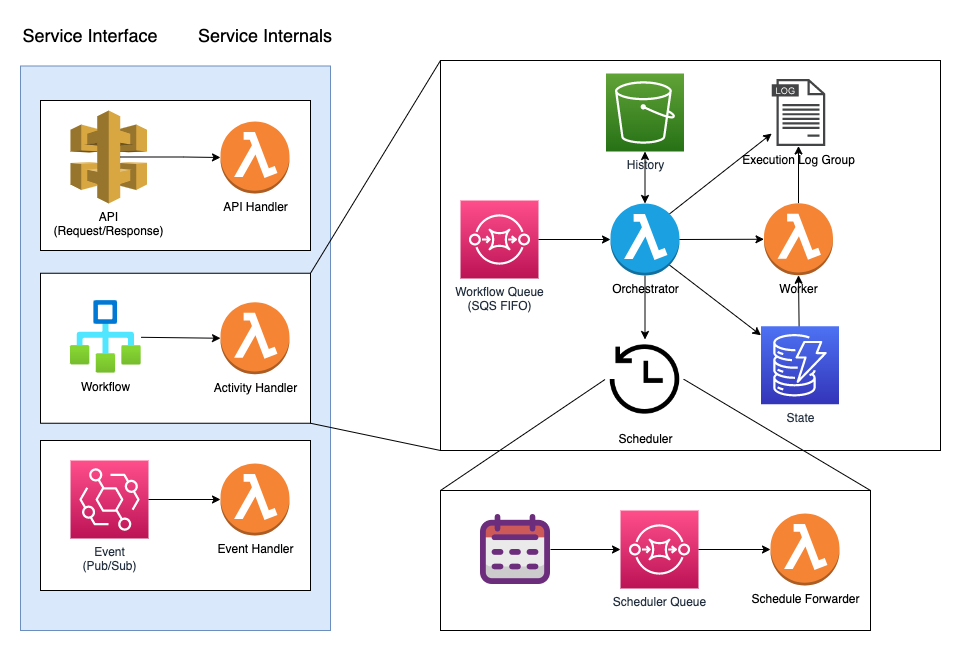
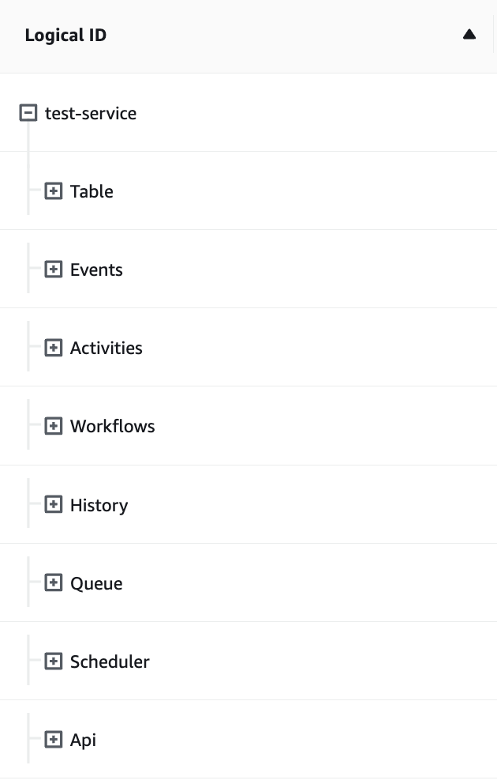
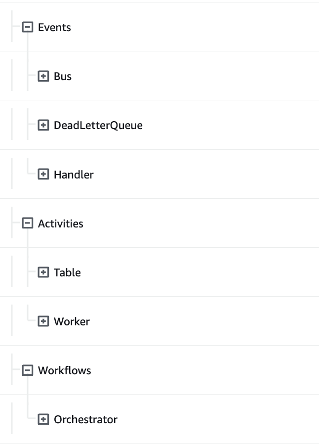

---
---

# AWS Architecture

Eventual is a serverless architecture that utilizes well-defined contracts to create a complex system that has a limited set of potential [failure scenarios](./1-failure-scenarios.md) that can be reasoned about without full understanding of the system. This design allows for an operationally efficient system (similar to a fully-managed service) that can be deployed into a user's AWS account and self-managed with minimal overhead.

:::info
In this section of the **Architecture & Internals** documentation, we will provide a high-level overview of the main components of the system, including their functions and interactions. Further details on each component will be covered in subsequent sections.
:::

### System Diagram

Below is a depiction of the architecture of an Eventual Service deployed in AWS. At a high-level, it contains the following components:

- API Gateway V2 with Lambda Function Handlers
- Internal API Routes for Eventual APIs (protected by AWS IAM and processed in individual Lambda Functions)
- Event Bridge Bus with Rules and a Lambda Function Handler running user code.
- Workflow Execution SQS FIFO Queue
- Workflow Orchestrator Lambda Function attached to the SQS FIFO Queue
- Event History S3 Bucket
- Event History DynamoDB Table
- Activity Handlers
- Activity Lock DynamoDB Table
- Event Bridge Schedule Group
- Scheduling SQS Queue with Schedule Forwarder Lambda Function

### API Gateway V2 with Lambda Function Handlers

The API Gateway V2 is responsible for handling incoming HTTP requests from users. It is connected to a Lambda Function that contains the user's code for handling the routes defined in the API. These APIs are defined using the `api` object from `@eventual/core` (which you can read more about [here](../reference/api.md)).

### Internal API Routes for Eventual APIs

Eventual Services deploy with an internal API available on the API Gateway. These APIs provide access to the internals of the service, such as starting a workflow execution. For more information on the API design, refer to the [Eventual REST API](./5-eventual-rest-api.md) documentation. The internal routes have their own separate Lambda function to ensure that the logic and security measures for internal requests do not affect the performance of user-defined routes. These routes are protected by AWS IAM authorization and can only be accessed by users or roles with the appropriate permissions.

### Event Bridge Bus with Lambda Function Handler

Event Bridge is a crucial component of Eventual's architecture, responsible for managing events that are received by the Service's Event Bus. All events produced internally by the Service or received from external systems pass through this Event Bus.

To handle these events, an Event Bridge [Rule](https://docs.aws.amazon.com/eventbridge/latest/userguide/eb-rules.html) is created for each subscription registered using the [`onEvent`](../reference/event.md#subscribe-to-an-event) function in `@eventual/core`. This allows for the ability to subscribe to specific events and react to them accordingly.

:::info
Subscriptions are detected using what we call ["Infrastructure Inference"](./4-infrastructure-inference.md) - at build-time, we run the user's code in a sandbox to detect the subscriptions.
:::

:::caution
It's important to note that currently, there is only one Lambda Function that processes events within a Service. However, as we continue to improve our bundling story, this may change in the future.
:::

Events can be routed between Services using Bus-to-Bus subscriptions. This functionality works across AWS accounts and regions, and more information can be found in the ["Using bus-to-bus event routing with Amazon EventBridge"](https://aws.amazon.com/blogs/compute/using-bus-to-bus-event-routing-with-amazon-eventbridge/) blog.

### Workflow Orchestrator Lambda Function

The Workflow Orchestrator is a Lambda function that is triggered by the [Event Loop Queue](#workflow-execution-event-loop---sqs-fifo-queue) to manage the execution of a workflow. The function is responsible for processing a batch of events, interpreting them using the [Eventual Interpreter](./2-interpreter.md), and generating a list of [Commands](./1-commands.md) to be executed. These Commands are then executed or enqueued, and persisted in the event history bucket for future reference.

In simple terms, the workflow orchestrator takes the next batch of events, plays them through the user's workflow function which then outputs the next "Commands" to invoke (for example start an activity, or schedule a timer). We call this the "event loop", similar to NodeJS's event loop, except processed in a distributed manor.

:::info
Workflows are ordinary functions that can execute over an arbitrary amount of time in a distributed serverless environment. For more information on how this is achieved, see the [Eventual Interpreter - Workflow Suspend & Resume](./2-interpreter.md#workflow-suspend--resume) documentation.
:::

### Workflow Execution Event Loop - SQS FIFO Queue

In Eventual, the event loop is the mechanism that governs the execution of a workflow. It is an SQS FIFO (First-In-First-Out) queue containing the events generated by a workflow. The execution's unique identifier, the `ExecutionId`, is used as the [`MessageGroupID`](https://docs.aws.amazon.com/AWSSimpleQueueService/latest/SQSDeveloperGuide/using-messagegroupid-property.html) to ensure that events for a specific execution are processed in the order they were produced.

SQS FIFO queues are designed for high throughput, able to support a high number of parallel executions and a rate of 300-3000 TPS per `MessageGroupId`. This allows Eventual to handle a large number of workflow executions simultaneously.

### Event History S3 Bucket

Eventual uses an S3 bucket to store the event history of a Workflow Execution. The event history captures all events that occurred during the execution of the workflow, including input events, and output events. This event history is used to restore the state of the workflow by replaying events through the workflow orchestrator function.

We rely on S3's strongly consistent [PutItem](https://docs.aws.amazon.com/AmazonS3/latest/API/API_PutObject.html) behavior to ensure that a Workflow always gets the latest data stored in S3. Additionally, as executions are guaranteed to be processed in series by the SQS FIFO queue, there is no concern of parallel writers. This allows for a simplified data model, where read after write consistency is all that is needed.

:::info
S3's PutItem operation is by far the most expensive aspect of Eventual's design, clocking in at $5 per million requests. This is 5x less than a state transition in AWS Step Functions, which is currently at $25 per million.
:::

### Event History DynamoDB Table

The event history of a workflow execution is stored in a DynamoDB Table. This table allows for quick access to the event history data via our internal APIs. The event history captures all events that occurred during the execution of the workflow, including input events, and output events, and is used for auditing, debugging, and troubleshooting of the workflow execution.

### Activity Handlers

Activity handlers are responsible for executing specific tasks as part of a workflow execution. To handle these activities, Eventual utilizes a Lambda Function.

To ensure that activities are executed durably, these handlers are invoked asynchronously using the ["EVENT"](https://docs.aws.amazon.com/lambda/latest/dg/invocation-async.html) invoke type. This effectively means a message in enqueued by the Orchestrator Lambda Function and processed later by the Activity lambda Function. This allows for the ability to retry failed executions, ensuring that activities are completed even in the presence of transient errors.

When an Activity completes, it sends a message back to the Workflow Orchestrator's SQS FIFO Queue with the result (success or failure). This message will wake the workflow back up which will process the result and advance the execution to the next step.

### Activity Lock DynamoDB Table

To ensure that activities are executed exactly once, Eventual utilizes a DynamoDB table for activity locks. When a request is received by an activity handler, it performs a pessimistic lock on a value in the DynamoDB table. This guarantees that only one request for the same activity is successfully executed, preventing duplicates caused by upstream retries or re-drives.

This is achieved by using a strongly consistent write to the DynamoDB table when acquiring the lock. This ensures that any duplicate requests are filtered out and that the lock is in place before the activity is executed, providing exactly-once semantics.

By using a DynamoDB table for activity locks, Eventual can ensure that activities are executed in a reliable and consistent manner, avoiding issues caused by duplicated or missed executions.

### Event Bridge Scheduler

:::caution Coming Soon
:::

### Scheduler SQS Queue

:::caution Coming Soon
:::

### Schedule Forwarder

:::caution Coming Soon
:::

## CloudFormation Stack Architecture

You can see this architecture reflected in the CloudFormation tree-view when looking at a deployed Service:

Expand the items to see what's contained, for example you can see the Event Bus and its Handler Function, the API's Gateway and its Handler Functions, etc:

