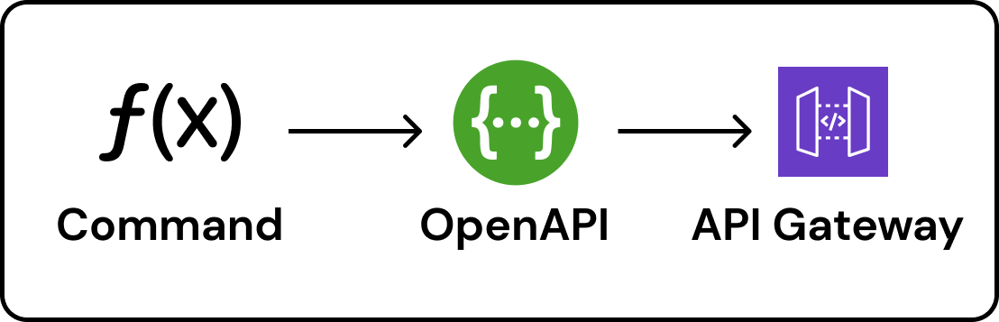
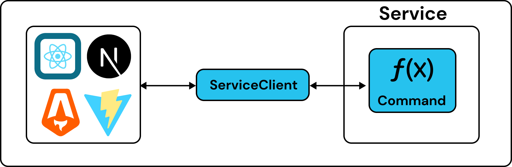

# API

Each Service has an HTTP API gateway that acts as an entry point for client requests. This can be thought of as your Service's "Synchronous Interface":


To build APIs, you can use Commands or define raw HTTP routes:

1. [Commands](#commands) - a simplified and streamlined RPC interface with a simple input/output contract
2. [HTTP](#http) - define raw HTTP methods, with GET, PUT, POST, PATCH, DELETE, etc.

## Command

Commands are simply functions that can be called over HTTP. They take a single input and return a single output:

```ts
export const hello = command("hello", async (name: string) => {
  return `hello ${name}`;
});
```

:::info
See the [Command](../reference/api/command.md) documentation for usage details.
:::

### Schemas

Commands support Zod for defining runtime validation schemas.

```ts
export const hello = command(
  "hello",
  {
    input: z.string(),
  },
  async (name) => {
    return `hello ${name}`;
  }
);
```

Eventual will automatically generate an OpenAPI specification for your Service and attach it to your API Gateway for validation.



Commands are designed to streamline implementation and integration. Using the [ServiceClient](../reference/api/client.md), you can call them directly from your frontend (or another service) without generating code.



Import the types of your backend, create a `ServiceClient` and start calling commands.

```ts
import type * as MyService from "@my/service";

const client = new ServiceClient<typeof MyService>({
  serviceUrl: "your-url",
});

// type-safe interaction with commands (no code gen)
await client.hello("my name");
```

:::info
See the [ServiceClient](../reference/api/client.md) documentation for usage details.
:::

## HTTP

In cases where you need access to the raw HTTP protocol, you can always register GET, PUT, POST, PATCH, etc. routes directly on the API Gateway.

```ts
api.get("/hello", async (request) => {
  const name = await request.text();
  return new Response(`hello ${name}`);
});
```

:::info
See the [HTTP](../reference/api/http.md) reference documentation for usage details.
:::

:::tip
We recommend using Commands over HTTP routes wherever possible. They are simpler, can be [adapted to REST](../reference/api/command.md#expose-a-command-as-a-restful-api) and can be called directly from your frontend or another Service using the [ServiceClient](../reference/api/client.md) without code generation or writing boilerplate code.
:::
