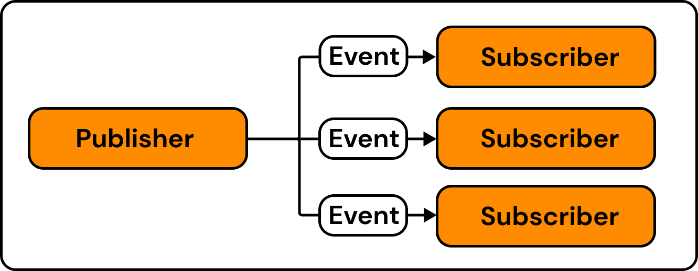
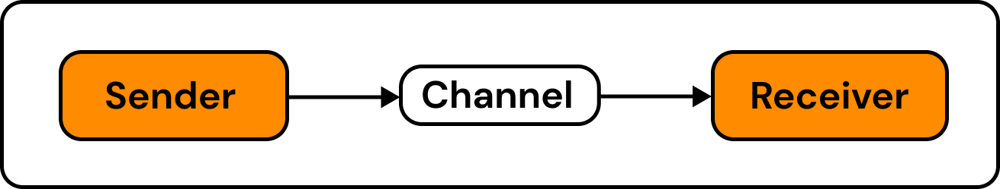

# Messaging

Eventual provides primitives for Messaging within a Service, including a broadcast emit/subscribe mechanism, and (coming soon) point-to-point Queues and Streams, and Actors.

## aka. Choreography

Messaging can be used to apply a technique known as "choreography". Choreography is a design pattern for communication between services, where each service is responsible for its own behavior and coordination is achieved through asynchronous message-passing.

:::info
See the [Event](../reference/messaging/event.md) and [Subscription](../reference/messaging/subscription.md) documentation or more information on how to implement choreography into your Service.
:::

### Difference between Choregraphy and Orchestration

The main difference between orchestration and choreography is that orchestration has a centralized controller that manages the interaction and flow of communication between services, while choreography relies on the autonomous and decentralized behavior of each service to achieve the coordination of the system.

:::info
See the [Orchestration](./orchestration.md) concept page or the [Workflow](../reference/orchestration/workflow.md) documentation for more information on Orchestration.
:::

## Emit and Subscribe

Eventual provides [Event Schemas](../reference/messaging/event.md) and [Subscriptions](../reference/messaging/subscription.md) for emitting and subscribing events. Events are emitted to a Service's Event Bus and then routed to Subscriptions.

## Point-to-Point(s)

Point-to-point channels are a way for services to communicate by sending messages from one service to another, where the sender adds messages into a Queue or Stream and the receiver reads and consumes them.

:::tip
They help services to work independently, control the flow of information, and ensure that messages are processed in the correct order.
:::

:::caution Coming Soon
Queues or Stream primitives are coming soon.
:::

## Actors

Actors are self-contained and independent entities that encapsulate both state and behavior, communicating with each other through asynchronous message passing.

:::caution Coming Soon
Actors are coming soon.
:::
