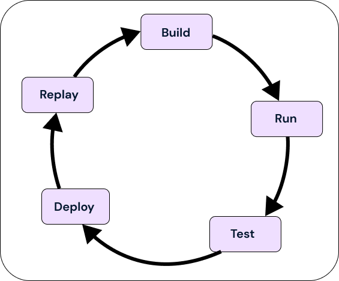

# Developer Lifecycle

Eventual is designed to provide a light-weight and fast developer lifecycle. In general, the process looks like as follows:

1. Build - start writing code, create Commands, Workflows, Activities, etc.
2. Test - write unit tests and mock out parts of your service
3. Simulate - run the service locally for instant feedback
4. Deploy - deploy the service to production
5. Replay - debug broken workflows by replaying them locally in your IDE
6. ... repeat

## Build

Start writing code. Add Commands, Workflows, Activities, Subscriptions, configure Infrastructure, etc.

## Test

Add unit tests for individual pieces. Mock out different parts of your application to test in isolation.

:::info
See [How to unit test](../how-to/unit-test.md) for more information.
:::

## Simulate

Run your Service locally to test it as a whole. Test how Commands, Subscriptions, Workflows and Activities interact with each other. Set breakpoints and follow execution across all of these pieces.

:::info
See [How to run locally](../how-to/run-locally.md) for more information.
:::

## Deploy

Once you're ready, you can deploy to AWS from the root, for example from within your CI/CD.

import Tabs from "@theme/Tabs";
import TabItem from "@theme/TabItem";
import CodeBlock from "@theme/CodeBlock";

<Tabs groupId="npm">
  <TabItem value="npm" label="npm" default>
    <CodeBlock>npm run deploy</CodeBlock>
  </TabItem>
  <TabItem value="yarn" label="yarn">
    <CodeBlock>yarn deploy</CodeBlock>
  </TabItem>
  <TabItem value="pnpm" label="pnpm">
    <CodeBlock>pnpm run deploy</CodeBlock>
  </TabItem>
</Tabs>

:::info
See [How to deploy a Service](../how-to/deploy.md) for more information.
:::

## Replay

When a workflow breaks in production, use the `eventual reply` CLI to download and replay a workflow locally to debug in your IDE.

:::info
See [How to debug production workflows](../how-to/debug-production-workflows.md) for more information.
:::
