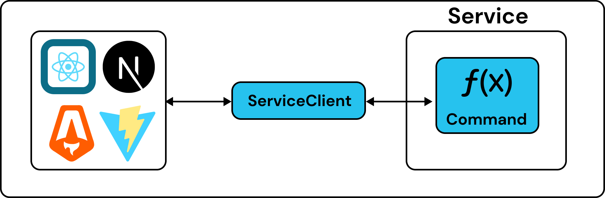
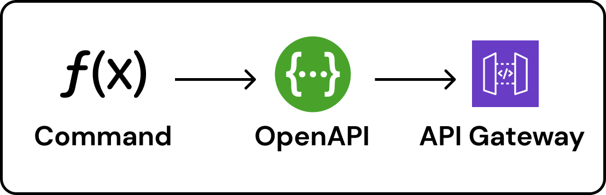

# End-to-End Safety

Eventual is designed to provide an end-to-end type-safe and schema-safe experience for building distributed systems with TypeScript.

- **Type-Safety** can catch simple errors all the way from a: consumer of a frontend → service implementation → infrastructure configuration.
- **Schema-Safety** ensures valid data is passed to APIs and Events by either attaching schemas to an API Gateway or performing runtime validation internally.

## Type-Safety

### Frontend → Service

With the [ServiceClient](../reference/api/client.md), you can call [Commands](../reference/api/command.md) directly from your frontend (or another service) without generating code.



Import the types of your backend, create a `ServiceClient` and start calling commands.

```ts
import type * as MyService from "@my/service";

const client = new ServiceClient<typeof MyService>({
  serviceUrl: "your-url",
});

// type-safe interaction with commands (no code gen)
await client.hello("my name");
```

:::info
See the [ServiceClient](../reference/api/client.md) documentation for usage details.
:::

### Service → Infrastructure

The same goes for when you’re configuring infrastructure. Import the types of the backend and then safely customize and integrate with each of the pieces of generated infrastructure.

```ts
import type * as MyService from "@my/service";

const service = new Service<typeof MyService>(this, "Service", {
  commands: {
    // safely configure any of the commands
    hello: {
      environment: { .. }
    }
  }
});

// safely access any generated infrastructure

// such as the hello Command's Lambda Function
service.commands.hello;

// or a Subscription's dead letter queue
service.subscriptions.onHelloEvent.deadLetterQueue
```

## Schema-Safety

Eventual integrates with Zod for defining schemas.

Schemas can be attached to [Commands](../reference/api/command.md)

```ts
export const helloCommand = command(
  "hello",
  {
    input: z.string(),
    output: z.string(),
  },
  async (name) => `hello ${name}`
);
```

... and [Events](../reference/messaging/event.md).

```ts
export const helloEvent = event(
  "HelloEvent",
  z.object({
    name: z.string(),
  })
);
```

These schemas are then used to generate specifications such as JSON Schema and Open API and perform runtime validation.


