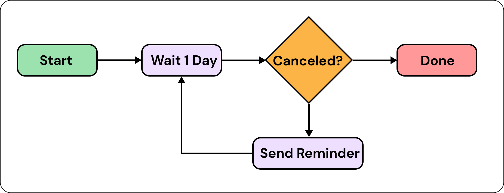
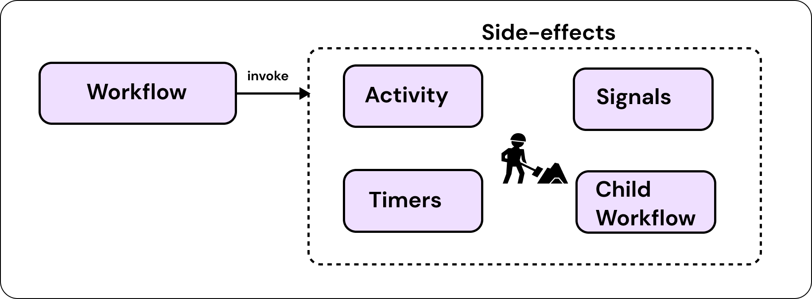

# Orchestration

Orchestration is the automated coordination and management of multiple services to work together to perform a specific task or achieve a common goal.

Eventual provides `workflow`, `task` and `signal` primitives that enable you to express complex coordination logic using traditional programming techniques, such as functions, if-else, loops, etc.

:::info
See the [Workflow](../reference/orchestration/workflow.md), [Task](../reference/orchestration/task.md) and [Signal](../reference/orchestration//signal.md) reference documentation for more information on how to implement orchestration into your Service.
:::

:::caution TODO
Video
:::

## Workflows are the decision makers

The `workflow` is the "decider". It chooses what to do and when. It does not perform actual work - instead, work is done by tasks. Workflows choose when to call tasks - i.e. orchestrate the work.

For example, to implement a workflow that will send a reminder email indefinitely on a daily schedule.



You can achieve this with a while loop and async/await:

```ts
const reminderWorkflow = workflow("reminder", async (email: string) => {
  while (true) {
    await duration(1, "day");

    await sendReminder(email);
  }
});

const sendReminder = task("sendReminder", async (email: string) => {
  await emailClient.send(email, "reminder message");
});
```

:::info
Workflows can wait for any amount of time, until a specific date and time, or until a condition or trigger is received - e.g the `await duration(1, "day")`. For more information see the [Time, Durations and Conditions](../reference/orchestration/workflow.md#time-durations-and-conditions) documentation.
:::

## Workflows co-ordinate People, Time and Services

Tasks and Signals provide a mechanism for communication between external systems and a running workflow execution.

:::tip
Go see 1) 2) 3)
:::

## Workflows have _exactly-once_ semantics

When a Workflow calls performs a side-effect, such as calling a task, emitting an Event or starting a Timer, it is guaranteed to run exactly once. These semantics allow you to safely control when a side-effect is applied to an external system without worrying about race conditions or intermittent failures.



## Workflows enable fault tolerance

Workflows and Tasks can configure timeouts, retry policies and failure canaries (aka. "heartbeats"). These are then enforced by the platform, enabling you to put predictable boundaries on long-running tasks and limit the blast radius of errors reliably without hand-rolling your own coordination logic.

## Workflows control concurrency

As the orchestrator, workflows can decide to run multiple tasks in parallel and control concurrency using Promises.

For example, to run many tasks in parallel and then wait for them all to complete, use `Promise.all`:

```ts
const [a, b] = await Promise.all([taskA(), taskB()]);
```

Or to wait for one of many tasks to complete and take the first one to resolve, use `Promise.race`:

```ts
const isCanceled = await Promise.race([
  duration(5, "minutes"),
  cancelSignal.expectSignal(),
]);

if (isCanceled) {
  // do something
}
```

:::info
See the [Mozilla docs on Promises](https://developer.mozilla.org/en-US/docs/Web/JavaScript/Reference/Global_Objects/Promise) to understand Promises on a deeper level.

Also see the [Workflow](../reference/orchestration/workflow.md) and [Workflow Patterns](../reference/orchestration/patterns/index.md) for more information on how to perform orchestration in Eventual.
:::
