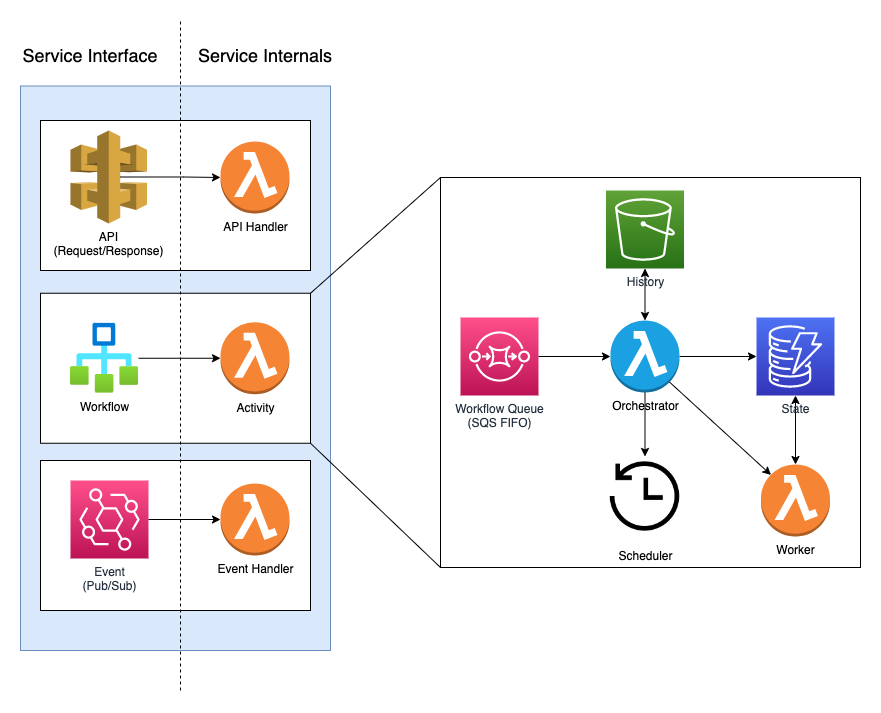

# Service

The foundational concept in Eventual is the "Service" - aka. a micro-service.

:::info
See the [Service](../reference/service.md) reference documentation for usage details.
:::

## Interface

Each Service exposes an Interface consisting of a Synchronous and Asynchronous component:

1. **Synchronous** - APIs that can be invoked.
2. **Asynchronous** - Events that can be emitted and subscribed.

## Implementation

Internally, a Service has Workflows, Tasks and Subscriptions that implement business processes and flows. These can be broken down into two categories:

1. **Orchestration** - Workflows coordinate how services work together by invoking Tasks, starting timers, emitting Events or waiting for Signals.
2. **Choreography** - a collection of Events and Subscriptions passing messages with no centralized controller.

:::info
See the [Orchestration](./orchestration.md) and [Choreography](./choreography.md) documentation.
:::

## Composition

Services can be composed together into service meshes. For example, Services can call another Service's API, or subscribe to Events from another Service. Each Service has its own dedicated infrastructure and can even run in their own AWS account for optimal isolation.

## Architecture

It consists of an API Gateway, an Event Bus, and Workflow engine. The API Gateway is responsible for exposing your business logic through an HTTP REST API, while the Event Bus enables the decoupling of services through the publication and subscription of events. The Workflows execute your business logic and can be triggered by events or API requests.

:::info
See the [Architecture and Internals](../architecture-and-internals/0-high-level.md) documentation for more details.
:::

