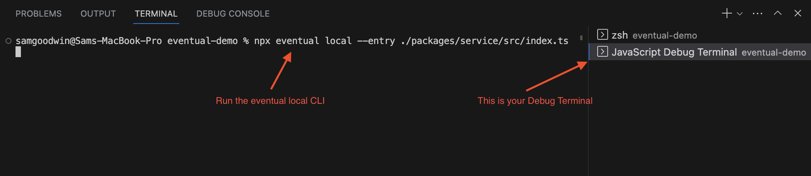

# Debug Production Workflows

For example, if a workflow failed, you can replay its history locally and use a step-through debugger to observe what happened.

## Replay

The `eventual replay` CLI supports running a workflow execution's history locally to help with debugging. All you need is the execu

```
eventual replay execution --execution myExecutionId --entry ./src/my-service.ts
```

:::info
See the [Replay CLI Reference Guide](../reference/cli#replay-execution) for more information.
:::

## Finding the Workflow Execution ID

You can find the workflow execution ID by listing failed executions with the CLI

```
npx eventual list executions --failed
```

:::info
See [List Execution Reference Guide](../reference/cli#executions) for more information.
:::

## Debug in VS Code

The simplest way to debug in VS code is to run the `eventual local` CLI within a JavaScript Debug Terminal.

To open a terminal, use the Command Palette and search for "JavaScript Debug Terminal".


Then, run the CLI in the new terminal:



You can now set breakpoints anywhere in your code and explore all of your Commands, Workflows, Tasks and Subscriptions in the context of a single runtime.
