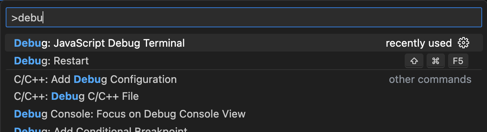
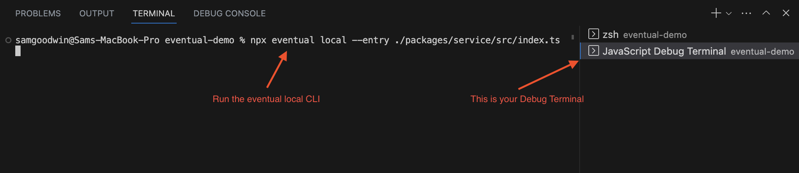

# Run Locally

Eventual ships with an `eventual local` CLI to run a service on your machine for quick and easy debugging.

## Start the Local Server

Run the following command in your project:

```
eventual local
```

This will start up a local server running the service located at `./packages/service/src/index.ts` and output a `localhost` URL you can then interact with.

```
Local Server running on http://localhost:4000
```

### Local relies on an initial deployment

When running `eventual local`, an initial deployment to the cloud is still necessary before you can get started. This is for two reasons:

1. Eventual only runs the "control" parts of your service locally - any databases like DynamoDB or S3, still need to be deployed.
2. The local code needs to assume an IAM Role to access these resources. This Role is deployed when you deploy the service.

## Interact with the Local Server

The server is just a plain HTTP server, so you can use any tool you'd like to make HTTP requests to your server. For example, cURL or Postman.

Eventual provides a `invoke` CLI for invoking Commands directly from the CLI without hand-crafting URLs.

```
eventual invoke hello "my name is sam"
```

## Debug in VS Code

The simplest way to debug in VS code is to run the `eventual local` CLI within a JavaScript Debug Terminal.

To open a terminal, use the Command Palette and search for "JavaScript Debug Terminal".



Then, run the CLI in the new terminal:



You can now set breakpoints anywhere in your code and explore all of your Commands, Workflows, Tasks and Subscriptions in the context of a single runtime.

## EVENTUAL_LOCAL Environment Variable

To detect when your code is running in a local environment, you can check for the Truthy-ness of the `EVENTUAL_LOCAL` environment variable.

```ts
if (process.env.EVENTUAL_LOCAL) {
  // in a local environment
}
```