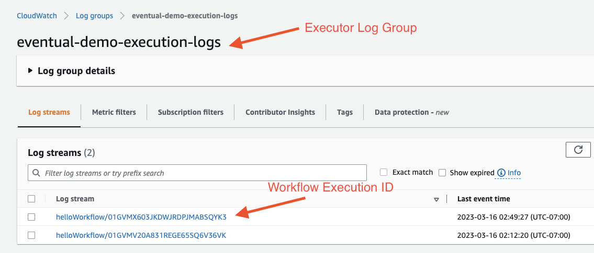
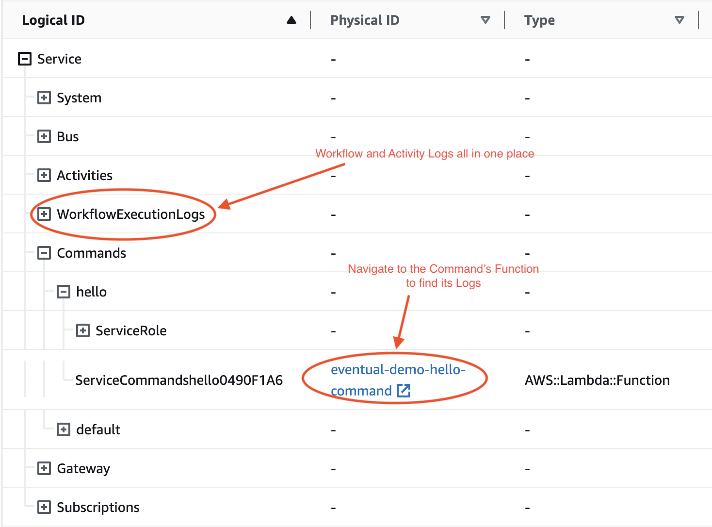

# Find your Service Logs

There are two aspects of logging to be aware of in Eventual: 1) traditional Lambda Function logs, and 2) workflow "executor" logs.

1. Each Command, Subscription and Task are bundled into their own Lambda Function. You can find logs for each of those Functions in the AWS console.
2. When you start a Workflow, all of the logs emitted by the Workflow code and any Tasks it calls are stored in the executor Log Group within a single Log Stream dedicated to that execution.

## Function Logs

Lambda Functions for Commands, Tasks and Subscriptions have the following naming convention.

- Command - `<service-name>-<command-name>-command`
- Task - `<service-name>-<command-name>-command`
- Subscription - `<service-name>-<command-name>-command`

:::tip
You can discover these logs in the AWS Console by searching for their name or by browsing the CloudFormation UI for your Service's Stack ([see below](#browse-your-stack-in-the-cloudformation-ui))
:::

:::caution
The Task's logs won't include logs you emit from your task code because we re-direct them to the [Executor Logs](#executor-logs) so that they are co-located within the context of a single workflow execution.
:::

## Executor Logs

Workflows can run for long periods of time and call many Tasks. To avoid spreading these logs out across many Log Groups and Log Streams, we re-direct them to the "Workflow Executor Log Group".

### Log Group in AWS Console

It has the following naming convention:

```
<service-name>-execution-logs
```

Each Log Stream in this Log Group corresponds to a single Workflow Execution. Given a workflow execution ID, you can find all logs centralized in a single Log Stream for convenience, regardless of the amount of time and Function invocation it spans.



## Using the Eventual CLI

You can get the logs for a workflow execution using the `eventual get logs` CLI.

```
eventual get logs --execution myExecutionId
```

:::info
See the [Eventual CLI Docs for Logs](../reference/cli.md#logs).
:::

## Browse your Stack in the CloudFormation UI

A convenient way to browse the logs is using the CloudFormation UI.


