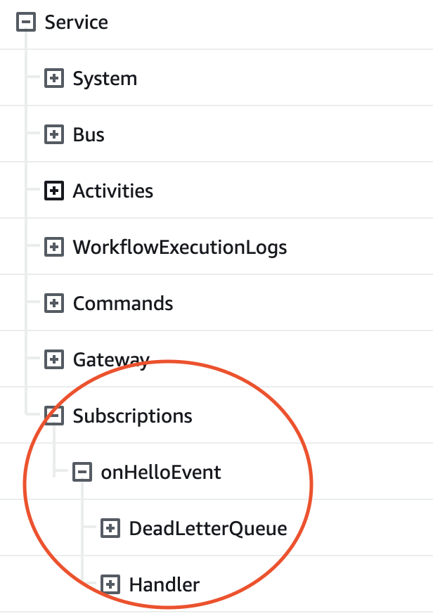

# Subscription

A Subscription registers a Function to be invoked for every Event flowing through the Service that matches a selection criteria.

## Subscribe to an Event

You can subscribe to events by calling the `subscription` function, passing an array of `events` to listen for and a callback function for processing events:

```ts
import { subscription } from "@eventual/core";

export const onMyEvent = subscription(
  "onMyEvent",
  {
    events: [myEvent, ..],
  },
  async (event) => {
    await processEvent(event);
  }
);
```

## Customize Runtime Properties

You can configure `memorySize`, `handlerTimeout` and `retryAttempts` on the `subscription` directly.

```ts
subscription(
  "onMyEvent",
  {
    events: [myEvent, ..],
    memorySize: 512,
    handlerTimeout: duration(1, "minute"),
    retryAttempts: 3
  },
  async (event) => {
    await processEvent(event);
  }
);
```

These values are then the default configuration when deployed. You can further customize these values in your infrastructure code if you desire (e.g for a dev environment):

```ts
new Service(this, "Service", {
  subscriptions: {
    onMyEvent: {
      memorySize: 1024,
      handlerTimeout: duration(2, "minute"),
      retryAttempts: 6,
    },
  },
});
```

:::tip
These layers of business logic and infrastructure code also apply to [Commands](../api/command.md) and [Tasks](../orchestration/task.md).
:::

## Dead Letter Queue

Each Subscription gets its own dedicated SQS Dead Letter Queue. You can find this queue in your infrastructure code:

```ts
const service = new Service(..);

// a reference to the subscription's dead letter
service.subscriptions.onMyEvent.deadLetterQueue;
```

You can also substitute your own SQS queue if you prefer:

```ts
import { aws_sqs } from "aws-cdk-lib";

const mySubstituteQueue = new aws_sqs.Queue(this, "MyQ");

new Service(this, "Service", {
  subscriptions: {
    onMyEvent: {
      deadLetterQueue: mySubstituteQueue,
    },
  },
});
```

:::tip
If you go to your deployed Stack in CloudFormation, you can see a list of all Subscriptions and their associated Dead Letter Queue and Handler Function.

<details>
<summary>Expand to see</summary>



</details>
:::

## Runtime Behavior

1. un-ordered
2. one-at-a-time
3. at-least-once .

### Un-Ordered

It is not guaranteed that events will be processed in the order they are published.

### One at a Time

Events are delivered to a subscription one at a time. There is no batching mechanism.

### At Least Once Delivery

Events are delivered to the function at least once. Failures are re-driven according to the retry policy.

:::caution
Your code should be defensively programed against duplicates, however rare.
:::
