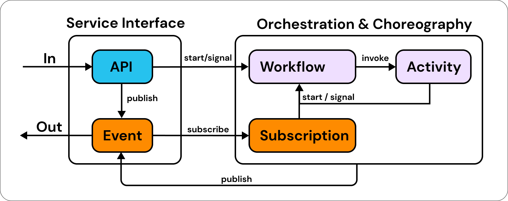

# Service

An Eventual Service is a composable and evolvable building block that is fundamentally asynchronous and event-driven. It consists of an API Gateway, an Event Bus, and Workflows. The API Gateway is responsible for exposing your business logic through an HTTP REST API, while the Event Bus enables the decoupling of services through the publication and subscription of events. The Workflows execute your business logic and can be triggered by events or API requests. Together, these components enable you to build and deploy scalable, maintainable, and resilient distributed systems in the cloud.



## Service Construct

A `Service` can be created with the AWS CDK Construct available in [`@eventual/aws-cdk`](https://www.npmjs.com/package/@eventual/aws-cdk).

```ts
const service = new Service(stack, "Service", {
  entry: path.resolve("services", "functions", "my-service.ts"),
});
```

## Business Logic

The `entry` property points to the entrypoint `.ts` or `.js` file that contains the application logic for your service. A service's application logic is implemented using the building blocks:

1. [Commands](./api/command.md)
2. [Events and Subscriptions](./messaging/event.md)
3. [Workflows](./orchestration/workflow.md)
4. [Activity](./orchestration/activity.md)

## Scaling Limits

For information on how to scale a Service in AWS, see [Service Scaling Limits](./service-scaling-limits.md).

## Service Name

Services are named to make them easier to identify and to determine the name of any generated AWS Lambda Functions

By default, a service's name is the CDK Construct's address, which is unique within a single AWS account and region, but may not be very user-friendly. We recommend naming your services in a consistent way that aligns with your organization.

```ts
const service = new Service(stack, "Service", {
  name: "cart-service-prod",
  entry: path.resolve("services", "functions", "my-service.ts"),
});
```

The names of your service are important when using the `eventual` CLI, for example when listing the services in an AWS account:

```
> eventual list services
cart-service-prod
payment-service-prod
```

Or when invoking a workflow:

```
> eventual start workflow checkout --inputFile ./input.json
```

For more information on how to use the CLI, see the [docs](./cli.md).

## Generated Lambda Functions

Each Command, Subscription and Activity will create its own AWS Resources, for example an AWS Lambda Function and (only for a Subscription) a Dead Letter SQS Queue.

The name of each generated Lambda Function and Dead Letter Queue is determined by the Service Name and the type of the entity. For example, a Command named `"myCommand"` created within a Service named `"my-service"` will be named `my-service-command-myCommand`. Consistently named Functions makes it easier to search and browse Resources with the AWS Console.

## Type-Safe glue between CDK and Business Logic

To create a type-safe connection between your CDK infrastructure code and your service's business logic, use a type-only import to import the type of your backend service and associate it with your `Service` Construct.

```ts
import type * as MyService from "@my/service";

const service = new Service<typeof MyService>(this, "Service");
```

Now, the `commands`, `activities` and `subscription` properties will be aware of the commands, activities and subscriptions defined within your service.

```ts
// in your service code:
export const myCommand = command("myCommand", async () => { .. });

// in your CDK code:
const service = new Service<typeof MyService>(this, "Service", {
  commands: {
    // myCommand is linked to the `myCommand` command defined in the service code
    myCommand: {
      memorySize: 512
    }
  }
});

// same is true on the Service instance
service.commands.myCommand; // <- the generated Lambda Function
service.activities.myActivity;
service.subscriptions.mySub.handler;
service.subscriptions.mySub.deadLetterQueue; // <- the generated Dead Letter Queue
```

:::caution
Make sure to export all of your commands, activities and subscriptions from the service's `index.ts` or else they will not be discoverable.

```ts
export * from "./my-command.js";
export * from "./my-activity.js";
// ...
```

:::

## Environment Variables

Set the `environment` property to specify environment variables on all Lambda Functions within the `Service`.

```ts
const service = new Service<typeof MyService>(stack, "Service", {
  entry: path.resolve("services", "functions", "my-service.ts"),
  environment: {
    TABLE_ARN: table.tableArn,
  },
});
```

The `addEnvironment` function can also be called to add environment variables on all Lambda Functions after creating the `Service` construct:

```ts
service.addEnvironment("TABLE_NAME", table.tableArn);
```

To override environment variables on specific handlers, use the `commands`, `activities` or `subscriptions` properties:

```ts
const service = new Service<typeof MyService>(stack, "Service", {
  entry: path.resolve("services", "functions", "my-service.ts"),
  commands: {
    myCommand: {
      // set environment variables only on the myCommand function
      environment: {
        TABLE_ARN: table.tableArn,
      },
    },
  },
});
```

Or call `addEnvironment` on specific Lambda Functions:

```ts
service.commands.myCommand.addEnvironment("TABLE_NAME", table.tableArn);
```

## Grant Permissions

The `Service` Construct implement `IGrantable` and can therefore be granted permissions using standard "grant" methods in the CDK. For example, granting read/write permissions to a DynamoDB Table:

```ts
table.grantReadWriteData(service);
```

The `api`, `event` and `activity` handler's IAM Roles will now have access to read/write to that DynamoDB Table.

You can also grant permissions to specific Lambda Functions:

```ts
table.grantReadWriteData(service.commands.myCommand);
```

## System Architecture

An Eventual Service provisions a fully serverless architecture that includes an API Gateway, an Event Bus, and a Workflow Engine made up of a SQS FIFO Queue, an S3 Bucket, a DynamoDB Table, and a Scheduler API. These components are connected and managed by Lambda Functions that contain your business logic and are bundled with the `@eventual/aws-runtime` library, which controls execution and provides services to your code. These Lambda Functions use managed event source subscriptions to trigger and orchestrate the various pieces of the architecture, making it easy to maintain and operate.


