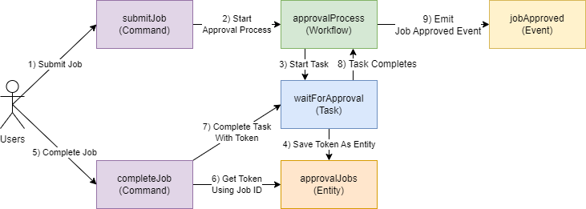

# Review and Test

Lets look at what we built and then run our workflow with the local development server.

## Review

The file system should look something like

```
\ src
   | approval-job.ts
   | approval-process.ts
   | complete-job.ts
   | index.ts
   | job-approved.ts
   | submit-job.ts
   \ wait-for-approval.ts
```

And this is what we created:



## Test Locally

Now lets test our new service locally. After this we'll deploy to AWS and test it there.

Notice the `--local` flag on all of the calls. We'll remove this later when we deploy to AWS.

First make sure your `watch` command (`[npx]|[yarn]|[pnpm] watch`) is still running or restart it.

Next restart the local command

```shell
npx eventual local
```

Now we'll use our service locally:

```shell
npx eventual invoke submitJob "this is my job description" --local
```

Grab the `jobId` that was returned, remember that the job id is also out execution id.

Check the status of the workflow

```shell
npx eventual get execution [job id] --local
```

It should say `IN_PROGRESS` because it is waiting for the approval task to complete. We can make that happen by invoking `completeJob`.

```shell
npx eventual invoke completeJob '{ "jobId": "[job id]", "approved": true }' --local
```

Now if you run:

```shell
npx eventual get execution [job id] --local
```

The result should look something like

```
[jobId]
Status: SUCCEEDED
StartTime: 2023-04-05T02:35:37.757Z
EndTime: 2023-04-05T02:35:54.251Z
Result:
Job was approved
```

You can see the details of the workflow run by running:

```shell
npx eventual get history -e [job id] --local
```

Which should output something like

```
✔ Getting execution history
2023-04-05T02:53:02.473Z        WorkflowStarted
2023-04-05T02:53:03.940Z        WorkflowRunStarted
2023-04-05T02:53:03.940Z        WorkflowRunCompleted
2023-04-05T02:53:03.940Z        TaskScheduled(0)
Task Name: "waitForApproval"
2023-04-05T02:54:03.554Z        TaskSucceeded(0)
Result: true
2023-04-05T02:54:03.731Z        WorkflowRunStarted
2023-04-05T02:54:03.731Z        WorkflowRunCompleted
2023-04-05T02:54:03.731Z        WorkflowSucceeded
Output: "Job was approved"
2023-04-05T02:54:03.731Z        EventsEmitted(1)
```
